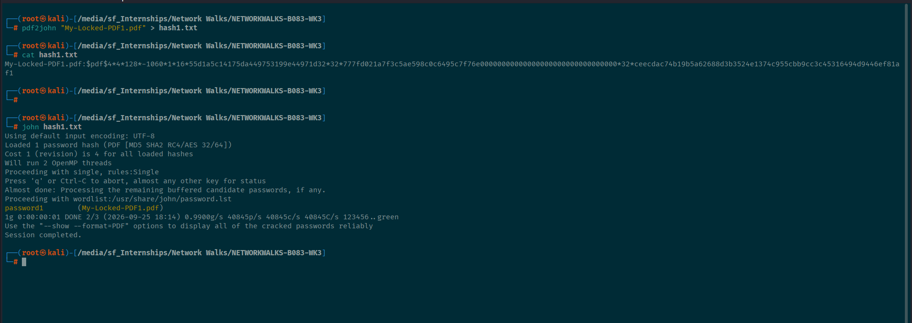
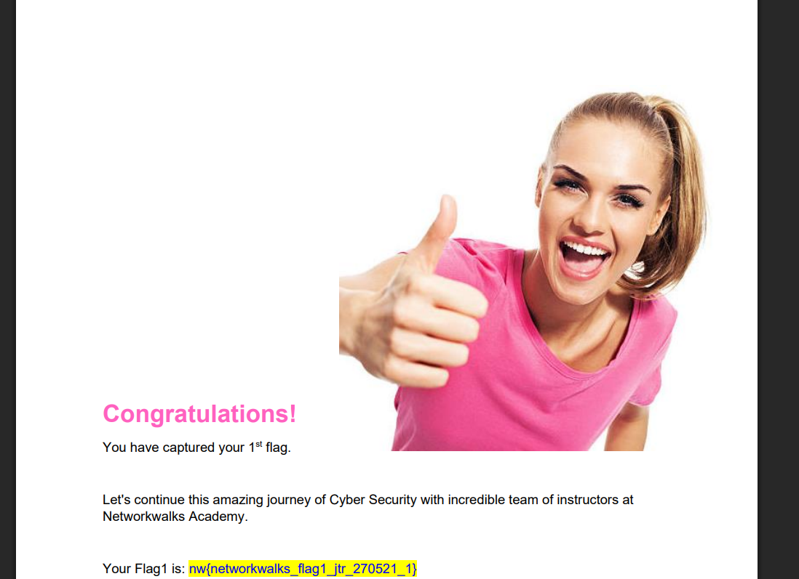

# Lab Report: Password Cracking with John the Ripper (JTR)

**Course Module:** Week 3 | Project Module 1 — Cybersecurity & Ethical Hacking
**Tool Used:** John the Ripper (Command Line Interface)
**Target File:** `My Locked PDF1.pdf`
**Operating System:** Kali Linux
**Date:** September 2026

---

## 1. Objective

To recover the password of a protected PDF file (`My Locked PDF1.pdf`) using John the Ripper, and to understand the underlying concepts of password hashing, encryption, and dictionary-based password recovery.

---

## 2. Background

John the Ripper (JTR) is an open-source password cracking and auditing tool originally built for Unix systems, now available on Windows, Linux, and macOS. It supports cracking many hash types and can recover passwords from protected files such as PDF, ZIP, and Microsoft Office documents.

This exercise was performed entirely via the command line, without using the Johnny GUI front-end.

**Key concept — Encryption vs. Hashing:**
- **Encryption** is a two-way function: encrypted data can be decrypted back to plaintext using the correct key.
- **Hashing** is a one-way function: plaintext is scrambled into a fixed-length digest that cannot be reversed directly — cracking tools instead guess inputs and compare their hashes.

---

## 3. Tools Used

| Tool | Purpose |
|---|---|
| John the Ripper (CLI) | Core password cracking engine (pre-installed on Kali Linux) |
| `pdf2john.pl` | Extracts a crackable hash from a password-protected PDF |

---

## 4. Procedure

### Step 1: Extract the hash from the PDF

Instead of using a third-party online hash extractor, the hash was generated locally using John the Ripper's bundled `pdf2john` utility (safer, since the file never leaves the local machine):

```bash
pdf2john "My-Locked-PDF1.pdf" > hash1.txt
```

Contents of `hash1.txt`:
```
My-Locked-PDF1.pdf:$pdf$4*4*128*-1060*1*16*55d1a5c14175da449753199e44971d32*32*777fd021a7f3c5ae598c0c6495c7f76e00000000000000000000000000000000*32*ceecdac74b19b5a62688d3b3524e1374c955cbb9cc3c45316494d9446ef81af1

```

### Step 2: Run John the Ripper against the hash

```bash
john hash1.txt
```

Output:
```
Using default input encoding: UTF-8
Loaded 1 password hash (PDF CMD5 SHA2 RC4/AES 32/64])
Cost 1 (revision) is 4 for all loaded hashes
Will run 2 OpenMP threads
Proceeding with single, rules: Single
Press 'q' or Ctrl-C to abort, almost any other key for status
Almost done: Processing the remaining buffered candidate passwords, if any.
Proceeding with wordlist:/usr/share/john/password. 1st
(My-Locked-PDF1.pdf)
passwordl
lg DONE 2/3 (2026-09-25 18: 14) ø.99øøg/s 40845p/s 40845C/s 40845C/s 123456 green
Use the "
show —format=PDF" options to display all of the cracked passwords reliably
Session completed.
```

This message indicated the hash had already been cracked in a previous run and was stored in John's potfile (`~/.john/john.pot`).



### Step 3: Verify by opening the PDF

The recovered password (`password1`) was used to open `My Locked PDF1.pdf` in a PDF reader, confirming successful decryption. The document displayed a "Congratulations — you have captured your 1st flag" message, confirming the exercise was completed correctly.

---


## 5. Alternative Commands Used / Available

| Purpose | Command |
|---|---|
| Force PDF format | `john --format=PDF hash1.txt` |
| Dictionary attack with wordlist | `john --wordlist=/usr/share/wordlists/rockyou.txt hash1.txt` |
| Dictionary attack with rules | `john --wordlist=rockyou.txt --rules hash1.txt` |
| Brute-force / incremental mode | `john --incremental hash1.txt` |
| Show cracked password | `john --show hash1.txt` |
| Re-crack after clearing potfile | `mv ~/.john/john.pot ~/.john/john.pot.bak` then `john hash1.txt` |

---

## 6. Result

| Item | Value |
|---|---|
| Target file | My Locked PDF1.pdf |
| Hash format | PDF (MD5/SHA2, RC4/AES 32/64) |
| Recovered password | `password1` |
| Cracking method | Dictionary attack (via John the Ripper potfile / default wordlist) |

---

## 7. Conclusion

This exercise demonstrated how John the Ripper can recover passwords from a protected PDF file by first converting the file's encryption metadata into a crackable hash format (`pdf2john`) and then running a dictionary or brute-force attack against that hash. The recovered password, `password1`, illustrates why weak, predictable passwords are trivial to crack and reinforces the importance of using long, complex, and unique passwords for sensitive documents.

---

## 8. References

- John the Ripper official site: https://www.openwall.com/john/
- Johnny GUI: https://openwall.info/wiki/john/johnny
- Lab material: NetworkWalks — *Password Cracking with JTR* (Week 3, Project Module 1)
