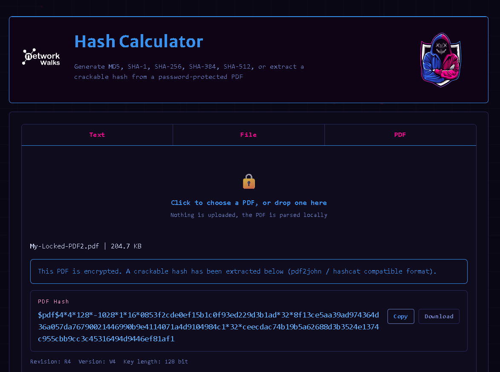
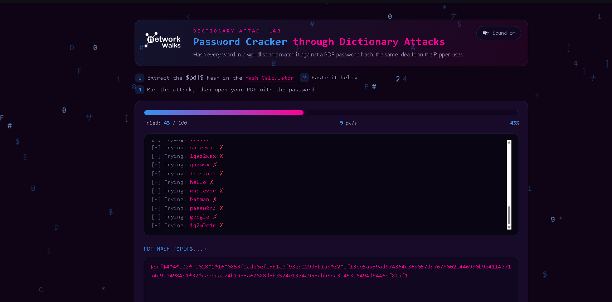
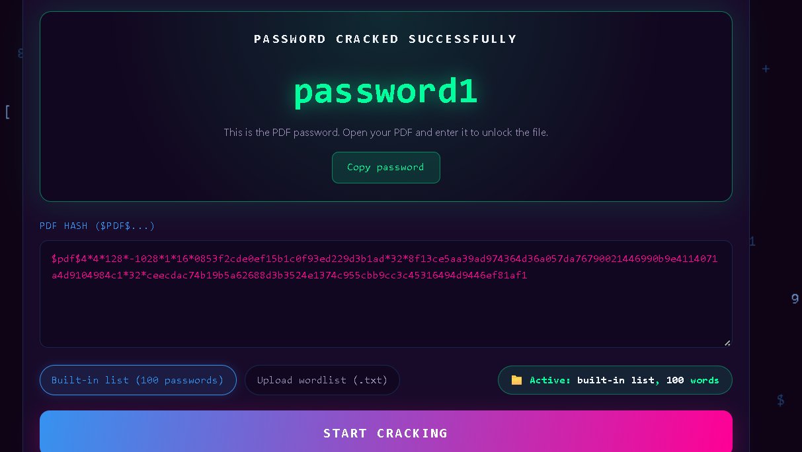

# Lab Report: Password Cracking with NetworkWalks Tools

**Course Module:** Week 3 | Project Module 2 — Cybersecurity & Ethical Hacking
**Tools Used:** NetworkWalks Hash Calculator, NetworkWalks Password Cracker (browser-based)
**Target File:** `My Locked PDF2.pdf`
**Date:** September 2026

---

## 1. Objective

To recover the password of a protected PDF file (`My Locked PDF2.pdf`) using two free, browser-based tools provided by NetworkWalks — the Hash Calculator and the Password Cracker — and to understand how the process mirrors what a local tool like John the Ripper does.

---

## 2. Background

Password cracking is the process of recovering a password from stored data or a protected file, used by security professionals to test password strength. When a file such as a PDF, ZIP, or Office document is locked, its password is not stored in plaintext — it is stored as a **hash**, a scrambled representation of the password. To recover the password, the hash must first be extracted from the file, then run through a cracking tool that tries candidate words until one produces a matching hash.

This lab used two browser-based tools instead of installing software locally:
- **Hash Calculator** — extracts a crackable (`pdf2john`/hashcat-compatible) hash from a password-protected PDF.
- **Password Cracker** — runs a dictionary attack against that hash, trying each word in a wordlist until a match is found (the same underlying idea as John the Ripper).

---

## 3. Tools Used

| Tool | URL | Purpose |
|---|---|---|
| NetworkWalks Hash Calculator | https://networkwalks.com/hash-calculator/ | Extracts a `$pdf$...` hash from a locked PDF |
| NetworkWalks Password Cracker | https://networkwalks.com/password-cracker/ | Runs a dictionary attack against the extracted hash |

---

## 4. Procedure

### Step 1: Download the encrypted PDF
The target file, `My Locked PDF2.pdf`, was downloaded from the lab page.

### Step 2: Open the Hash Calculator
Navigated to the NetworkWalks Hash Calculator in a web browser.

### Step 3: Extract the hash
Uploaded the locked PDF to the Hash Calculator (via the **PDF** tab). The tool parsed the file locally in-browser and returned a crackable hash beginning with `$pdf$...`:

```
$pdf$4*4*128*-1028*1*16*0853f2cde0ef15b1c0f93ed229d3b1ad*32*8f13ce5aa39ad974364d36a057da76790021446990b9e4114071a4d9104984c1*32*ceecdac74b19b5a62688d3b3524e1374c955cbb9cc3c45316494d9446ef81af1
```

### Step 4: Copy the full hash
Copied the complete hash value, ensuring nothing was truncated.

### Step 5: Open the Password Cracker
Navigated to the NetworkWalks Password Cracker tool.

### Step 6: Paste the hash and start the attack
Pasted the `$pdf$...` hash into the Password Cracker and clicked **Start Cracking**. The tool ran a dictionary attack, trying each entry in its built-in wordlist (100 passwords) against the hash.


### Step 7: Retrieve the cracked password
After trying several candidates (e.g. `service`, `canada`, `hockey`, `killer`, `george`, `asdfgh`, `zxcvbn`, `qwertyuiop`, `111222`), the tool found a match:

```
PASSWORD CRACKED SUCCESSFULLY
password1
```


### Step 8: Open the PDF with the cracked password
Opened `My Locked PDF2.pdf` and entered `password1` at the password prompt.

### Step 9: Verify success
The PDF opened successfully, displaying a "Congratulations — you have captured your 1st flag" confirmation page.

---


## 5. Result

| Item | Value |
|---|---|
| Target file | My Locked PDF2.pdf |
| Hash format | PDF (pdf2john/hashcat-compatible, `$pdf$...`) |
| Cracking method | Dictionary attack (built-in 100-word list) |
| Recovered password | `password1` |

---

## 6. Conclusion

This lab demonstrated that the same password-recovery workflow used by command-line tools like John the Ripper can be performed entirely through the browser, without installing any software. The Hash Calculator extracted a crackable hash locally (no file upload to a server), and the Password Cracker matched it against a common-password dictionary almost immediately. The exercise reinforces that simple, dictionary-guessable passwords such as `password1` offer little real protection, regardless of which tool — local or browser-based — is used to crack them.

---

## 7. References

- NetworkWalks Hash Calculator: https://networkwalks.com/hash-calculator/
- NetworkWalks Password Cracker: https://networkwalks.com/password-cracker/
- Lab material: NetworkWalks — *Password Cracking with NetworkWalks Tools* (Week 3, Project Module 2)
